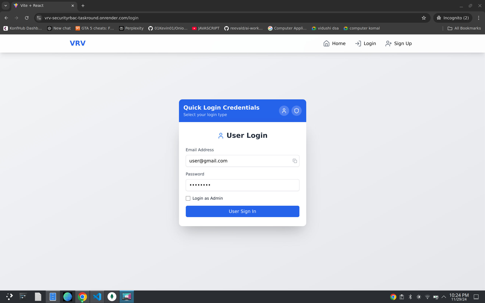
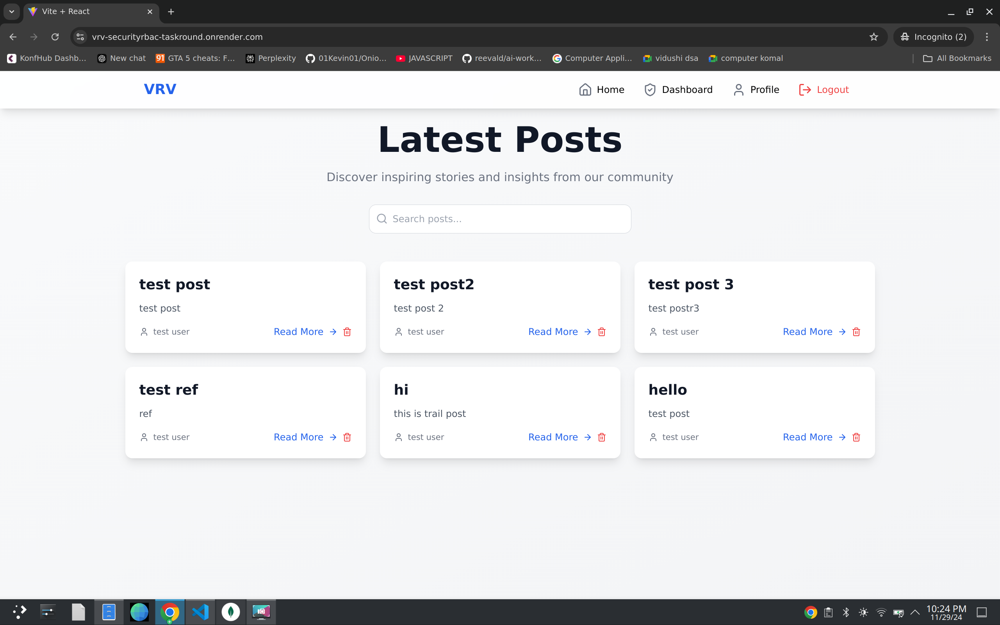
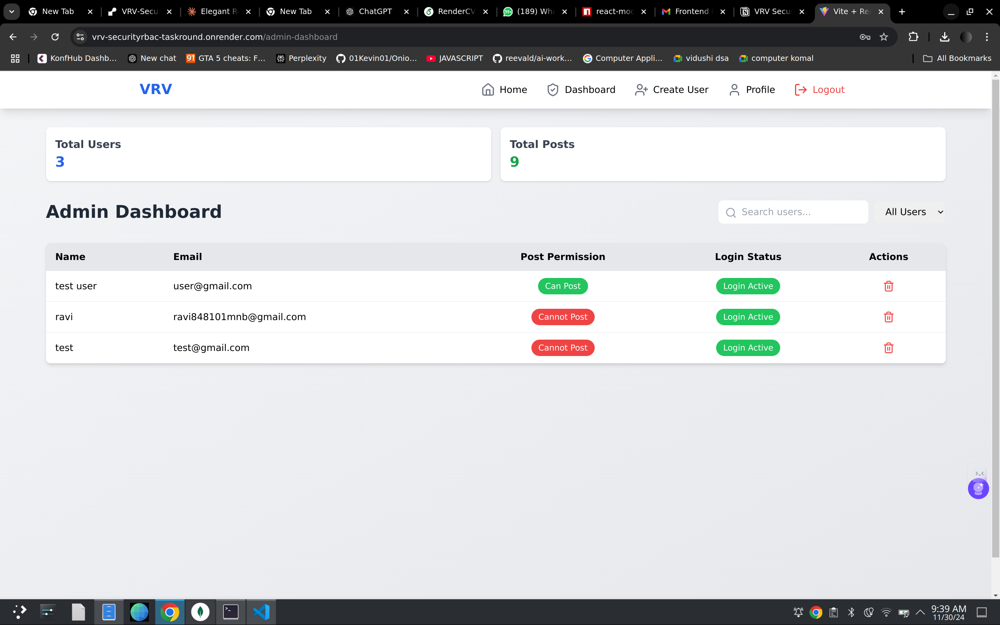
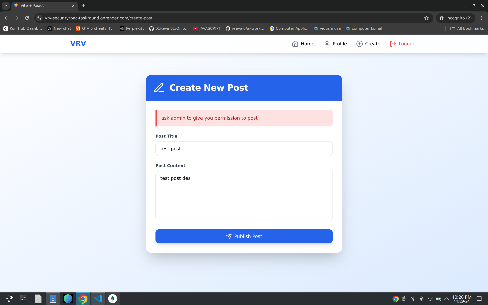
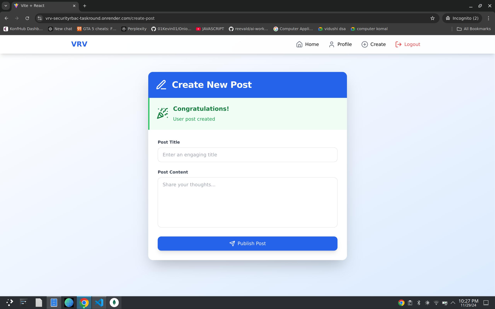
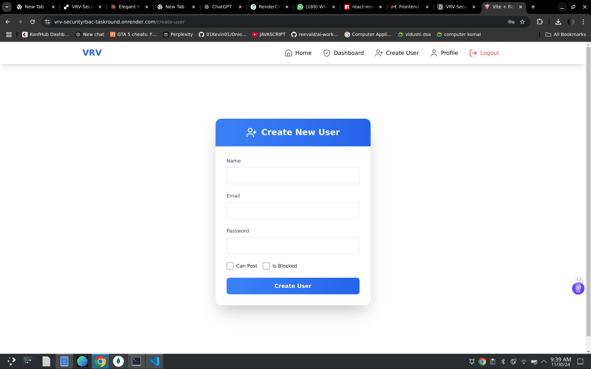
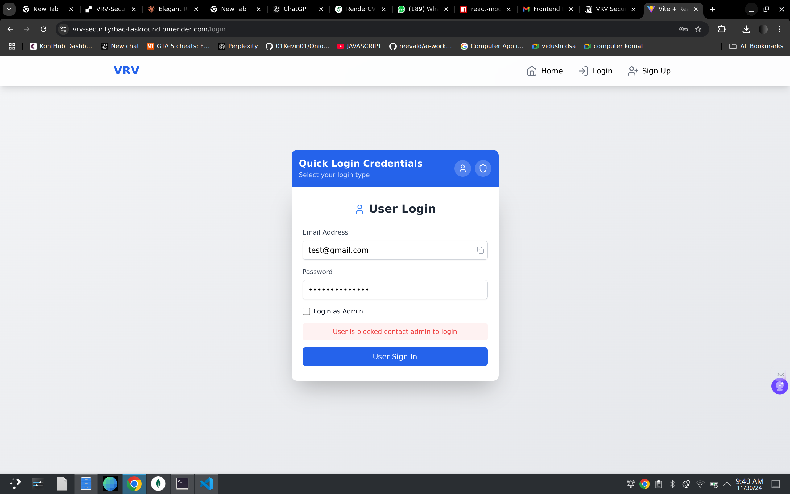

# VRV Security RBAC Task Round

This project implements a Role-Based Access Control (RBAC) system for managing user roles and permissions. It consists of a client-side application and a server-side backend, both designed to work together seamlessly.

## Table of Contents

- [Features](#features)
- [Screenshots](#screenshots)
- [Getting Started](#getting-started)
  - [Prerequisites](#prerequisites)
  - [Installation](#installation)
- [Usage](#usage)
  - [Default Credentials](#default-credentials)
- [Deployment](#deployment)

## Features

- Role-based access management
- User authentication and authorization
- Secure API endpoints
- Responsive front-end design

## Screenshots

  
_Caption: login screen tap quick login credential icons to use defalut password_

  
_Caption: Admin role have delete button_

  
\_Caption: Admin can change user can post or not or can login or not

  
_Caption: user without admin permit cannot post anything_

  
_Caption: user can post if admin grant access_

  
\_Caption: admin can create user

  
\_Caption: Blocked user cannot login

## Getting Started

### Prerequisites

Ensure you have the following installed:

- Node.js
- npm or yarn

### Installation

1. Clone the repository:

   ```bash
   git clone https://github.com/Ravi02RR/VRV-SecurityRBAC-TaskRound.git
   ```

2. Navigate to the project directory:
   ```bash
   cd vrv-securityrbac-taskround
   ```

### Running the Client

1. Navigate to the `client` folder:

   ```bash
   cd client
   ```

2. Install dependencies:

   ```bash
   npm install
   ```

3. Start the development server:
   ```bash
   npm run dev
   ```

### Running the Server

1. Open a new terminal and navigate to the `server` folder:

   ```bash
   cd ../server
   ```

2. Install dependencies:

   ```bash
   npm install
   ```

3. Start the server:
   ```bash
   npm run dev
   ```

### Access the Application

Once both the client and server are running, open your browser and navigate to:

```
Frontend: http://localhost:5173
Backend: https://vrv-securityrbac-taskround.onrender.com
```

## Usage

### Default Credentials

#### User

- **Email:** `user@gmail.com`
- **Password:** `user1234`

#### Admin

- **Email:** `admin@gmail.com`
- **Password:** `admin1234`

## Deployment

The application is deployed at the following link:

[VRV Security RBAC Task Round - AWS Deployment](https://vrvtask.devguy.live/)
